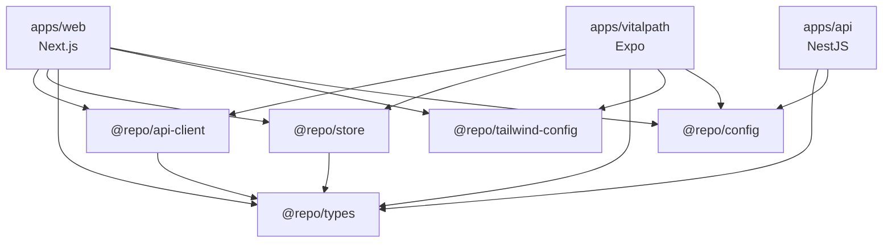

# Arquitectura de los Paquetes Compartidos

La carpeta `packages/` sigue una arquitectura de monorepo gestionada por **Turborepo** junto con los **Workspaces de pnpm**. Esta configuración permite compartir código y configuraciones eficientemente entre el frontend, el backend y la app móvil.

## Tipo de Empaquetado

- **pnpm Workspaces**: Definido en `pnpm-workspace.yaml`, permite que las dependencias locales se enlacen (link) simbólicamente mediante el protocolo `workspace:*` en los `package.json`.
- **Turborepo**: Orquesta las tareas de construcción (build), linting y testing mediante el archivo `turbo.json`. Permite la ejecución en paralelo y el almacenamiento en caché para compilar únicamente lo que ha cambiado.

## Dependencias Internas entre Paquetes

Los paquetes están diseñados de manera modular. A continuación, se muestra cómo interactúan:

- **`@repo/api-client`**: Depende de `@repo/types` (para las interfaces como `TokenAdapter`).
- **`@repo/store`**: Depende de `@repo/types` (para tipar las sesiones de usuario `UserSession` y otros datos de negocio).
- **`@repo/types`**: Es un paquete base sin dependencias internas, depende solo de utilidades externas (como `zod`).
- **`@repo/config`**: Proporciona las reglas de linting y formateo para todos los demás paquetes.
- **`@repo/tailwind-config`**: Sin dependencias internas, expone variables CSS y configs de Tailwind.

## Responsabilidad de cada Tipo de Paquete

### 1. Paquetes de Lógica de Negocio y Estado (`store`)

- Actúan como la fuente de verdad del estado de la aplicación en los clientes (frontend y móvil).
- Se abstraen de las implementaciones específicas de la plataforma inyectando interfaces como `StorageAdapter`, permitiendo que Zustand funcione con `localStorage` en web o `AsyncStorage` en móvil.

### 2. Paquetes de Interfaz de Usuario y Estilos (`tailwind`)

- Unifican la identidad visual del proyecto.
- Permiten tener los mismos tokens de diseño tanto en componentes web de React (Next.js).

### 3. Paquetes de Clientes de API (`api-client`)

- Centralizan la lógica de comunicación con el backend NestJS.
- Manejan los flujos complejos de autenticación, como la intercepción de errores `401 Unauthorized`, el refresco de tokens, y la inyección de cabeceras de autorización (`Authorization: Bearer`).

### 4. Paquetes de Tipos e Interfaces (`types`)

- Proveen tipado estático `strict` para todo el ecosistema.
- Contienen validaciones Zod, asegurando que tanto el backend que recibe los datos como el frontend que los envía validen bajo la misma regla de negocio.

## Integración con los Consumidores

### Backend (NestJS)

- **Tipos Compartidos**: Importa interfaces de `@repo/types` para tipar respuestas y usar validadores Zod en los pipes de NestJS.
- **Configuración**: Usa `@repo/config` para mantener el mismo estándar de código.

### Frontend (Next.js)

- **Cliente HTTP**: Usa `apiClient` configurando el flujo de refresh token por cookies de solo lectura (modo `'cookie'`).
- **Estado**: Instancia el `auth.store` pasando un adaptador de `localStorage`.
- **Estilos**: Importa `@repo/tailwind-config` dentro de su `tailwind.config.ts`.

### App Móvil (React Native / Expo)

- **Cliente HTTP**: Usa `apiClient` configurando el flujo de refresh token por cuerpo de petición y almacenamiento seguro (modo `'body'`).
- **Estado**: Instancia el `auth.store` pasando un adaptador que usa `AsyncStorage` / `SecureStore`.
- **Estilos**: Usa `@repo/tailwind-config` configurado para compatibilidad con NativeWind.

## Diagrama de Dependencias (Arquitectura)

