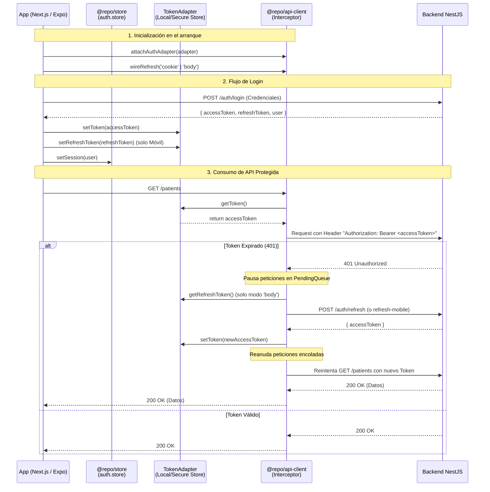
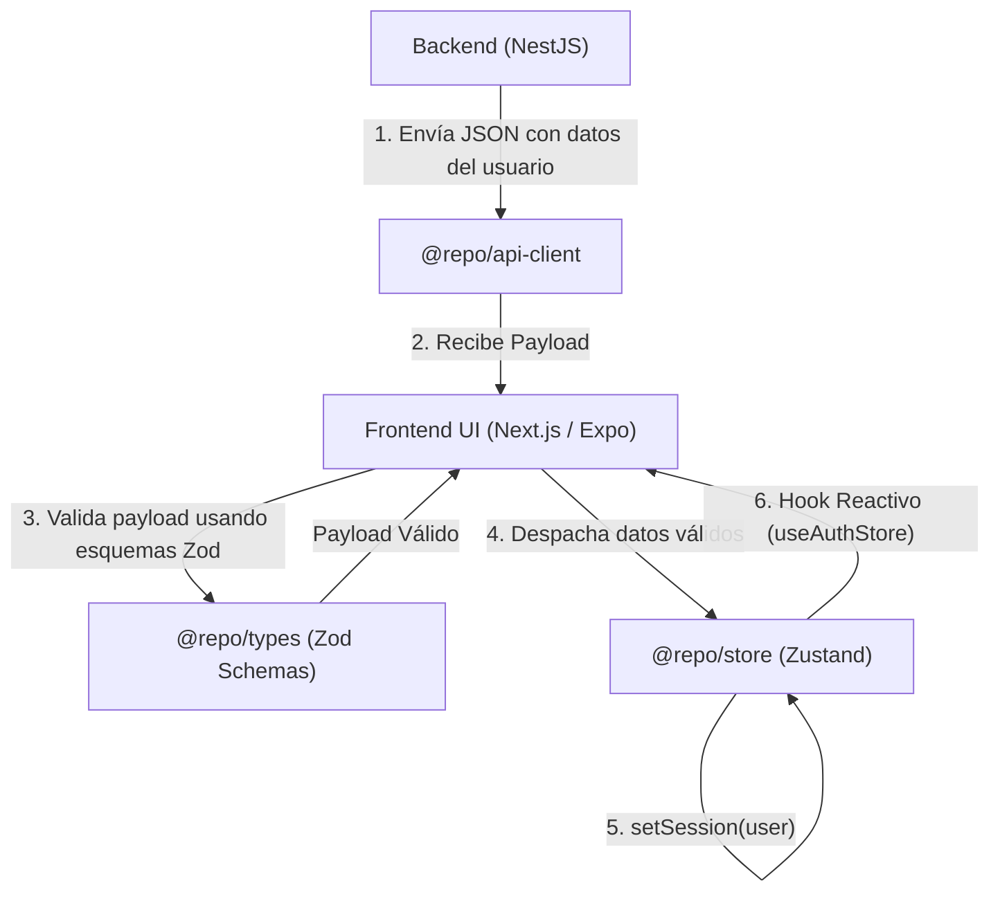

# Diagramas de Flujos Compartidos

Estos diagramas detallan cómo viaja la información crítica (tokens de autenticación y datos de usuario) a través de los distintos paquetes del ecosistema hacia y desde los clientes y el servidor.

## 1. Flujo del Token de Autenticación

Este flujo describe cómo se inyecta, usa y renueva el token JWT empleando la lógica de `@repo/api-client`.

### Explicación Paso a Paso del Flujo del Token

1. **Inicialización**: Al arrancar la app web o móvil, se inyecta el `TokenAdapter` apropiado en `@repo/api-client`. Se configura el modo de refresco (`cookie` para web, `body` para móvil).
2. **Login**: La aplicación cliente hace un login. Tras el éxito, los tokens se guardan en el almacenamiento del dispositivo vía el adaptador, y los datos del perfil se guardan en `@repo/store` (`auth.store`).
3. **Petición Estándar**: Cada vez que se usa el `apiClient`, el interceptor de peticiones solicita el token al `TokenAdapter` y lo añade a las cabeceras.
4. **Refresco (Refresh)**: Si el NestJS responde con un `401 Unauthorized` por token caducado, el interceptor de `@repo/api-client` intercepta el error, encola las demás peticiones concurrentes y solicita un nuevo token. Tras el éxito, actualiza el adaptador y reintenta la petición original de forma transparente para la UI.

---

## 2. Flujo de Datos de Usuario

Describe cómo la información del usuario se valida, almacena y consume a lo largo de los paquetes.

### Explicación Paso a Paso del Flujo de Datos

1. **Recepción desde el Backend**: La aplicación cliente realiza una llamada usando `@repo/api-client` (e.g. `/auth/me` o tras el login) y recibe los datos del usuario.
2. **Validación (Types/Zod)**: Antes de confiar en la data, el cliente (o el propio NestJS antes de enviarla) puede validarla usando los esquemas compartidos en `@repo/types`. Esto garantiza que los datos que entran a la aplicación cumplen con las reglas estipuladas.
3. **Actualización de Estado Global (Store)**: La UI toma los datos validados y llama a la acción `setSession(user)` proporcionada por `@repo/store` (`auth.store`).
4. **Reactividad**: Cualquier componente en `apps/web` o `apps/vitalpath` que utilice el hook `useAuthStore(state => state.user)` se re-renderizará automáticamente con los nuevos datos médicos o de perfil. El store se encarga de persistir esta sesión en `localStorage` o `AsyncStorage` de forma transparente.
